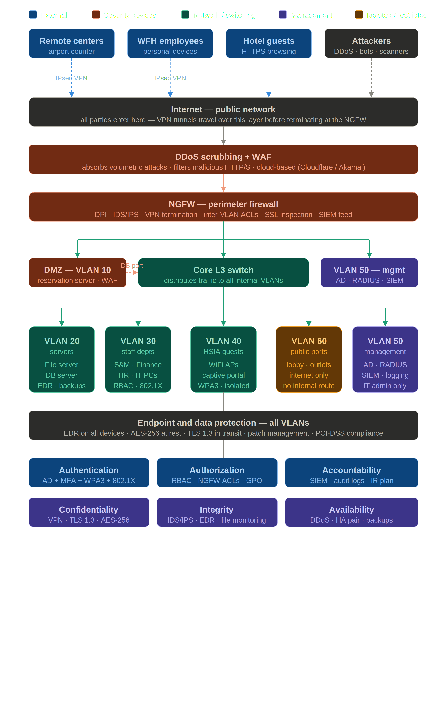

# Secure Network Design

## Overview

This paper presents a research-oriented security architecture proposal developed in response to a series of critical network incidents at Van615 Hotel, a medium-sized hospitality establishment. Rather than prescribing a single vendor solution, this work examines the underlying vulnerabilities exposed by those incidents and proposes a principled, layered security design that can serve as a reference implementation for similar organisations operating in the hospitality sector. The design decisions documented here are grounded in established network security frameworks and the CIA triad and AAA model, and are intended to be evaluated critically rather than applied wholesale without contextual adaptation.

The paper is structured as follows. The Background section describes the hotel's existing network infrastructure and the five security incidents that motivated this work, establishing the threat context from which all subsequent design decisions derive. The Threats and Vulnerabilities Assessment identifies the root causes underlying those incidents — principally a flat, unsegmented network, the absence of any perimeter defence, unencrypted remote communications, and a complete lack of centralised access controls. The Proposed Secure Network Architecture section presents the core response: a defence-in-depth design built around a next-generation firewall, VLAN-based network segmentation, a DMZ for internet-facing services, mandatory VPN for all remote access, and Active Directory-based identity management. The Security Policies section translates the technical architecture into governance controls covering access, remote access, data protection, incident response, patch management, and employee awareness. Finally, the Architecture Design section describes the proposed topology in full, mapping each component to the six security principles of Authentication, Authorization, Accountability, Confidentiality, Integrity, and Availability, and providing the reference network diagram that serves as the visual centrepiece of this proposal.

---

## Background

Van Hotel, a medium-sized hospitality establishment, faced a series of disruptive incidents, underscoring critical security vulnerabilities. These incidents included:

- A data breach exposing guest credit card info
- A DDoS attack taking down the online reservation system
- Ransomware encrypting critical department systems
- A man-in-the-middle attack on the guest Wi-Fi (HSIA)
- Guests exploiting unsecured data ports to access the internal network

Current infrastructure problems:

- Flat, unsegmented internal network (all departments share one connection)
- No Active Directory — running in workgroup mode
- Public area data ports connected directly to the internal network
- Remote reservation centers communicating over the open internet
- Employees using personal phones and working remotely without clear security controls

---

## Threats and Vulnerabilities Assessment

Based on the five incidents, the current infrastructure has these root causes:

- **Flat network with no segmentation** — all departments share one switch, meaning any compromised device can reach every other device. This enabled the ransomware to spread across all departments and guests to access the internal network from public data ports.

- **No perimeter defense** — there is no firewall between the internet and internal systems. The router connects directly to the core switch, leaving the web tier, business tier, and data tier fully exposed to the internet.

- **Unsecured public access** — lobby and outlet data ports are plugged into the internal network switch, giving physical access to anyone in public areas.

- **No encryption on guest/remote traffic** — remote reservation centers and the airport counter communicate over plain internet with no VPN, making interception trivial (the MITM attack on HSIA and the reservation data breach both exploit this).

- **No access controls or directory services** — the network runs in workgroup mode with no Active Directory, meaning there is no centralized authentication, no role-based access, and no audit trail.

- **Single point of failure on availability** — no redundancy or DDoS mitigation meant one sustained attack took the online reservation system fully offline.

---

## Proposed Secure Network Architecture

The core principle is defense in depth: multiple independent layers so that breaching one does not compromise everything.

- **Perimeter layer** — replace the bare router with a next-generation firewall. The NGFW performs deep packet inspection, intrusion detection/prevention (IDS/IPS), and acts as the VPN endpoint for all remote sites. Place a Web Application Firewall (WAF) and a DDoS scrubbing service in front of the online reservation system specifically, since it is internet-facing.

- **Network segmentation with VLANs** — replace the flat core switch with a managed Layer 3 switch and create isolated VLANs for each zone:

| VLAN | Zone | Devices |
|------|------|---------|
| 10 | DMZ | Online Reservation Server, Web tier |
| 20 | Internal servers | File Server, Database Server, Business tier |
| 30 | Staff departments | S&M, Finance, HR, IT, Admin PCs |
| 40 | HSIA (guests) | All guest WiFi access points |
| 50 | Management | IT admin consoles, network devices |
| 60 | Public area ports | Lobby/outlet data ports — isolated, internet-only |

All inter-VLAN traffic routes through the NGFW, which enforces strict ACL rules (e.g. VLAN 40 guests can reach the internet only; VLAN 60 public ports get internet access only with no path to any internal VLAN).

- **DMZ for internet-facing services** — move the Online Reservation System Server into a DMZ between two firewall zones. External users hit the WAF → DMZ server → internal database over a tightly controlled path. The database server never has a direct internet-facing interface.

- **VPN for all remote sites** — require IPsec or SSL VPN tunnels for remote reservation centers, airport counter, and WFH employees. No unencrypted internet communication to headquarters.

- **Active Directory & centralized IAM** — deploy Windows Server with Active Directory Domain Services. All staff devices join the domain. Implement role-based access control (RBAC) so each department can only access its own resources. Enable multi-factor authentication (MFA) for all remote and privileged access.

- **Endpoint & data protection** — deploy endpoint detection and response (EDR) on all staff PCs and servers. Implement regular automated backups with offline/immutable copies (to defeat ransomware). Enable full-disk encryption on servers and laptops. Apply the principle of least privilege on all service accounts.

- **HSIA hardening** — move the guest WiFi onto its own isolated VLAN (40) with a captive portal for authentication. Implement WPA3 encryption on all access points. The HSIA network must have zero routing to internal VLANs — guests reach the internet only. Consider a separate physical uplink for guest traffic.

---

## Security Policies

**Access control policy** — all users authenticate via Active Directory with MFA. Access is granted by role, not by individual. Privileged accounts (IT admins) are separated from daily-use accounts. Shared/generic accounts are prohibited.

**Remote access policy** — all remote connections must use VPN with certificate-based authentication. Personal devices (BYOD phones, WFH laptops) must pass a posture check (up-to-date OS, active EDR) before VPN admission.

**Network use policy** — guest devices are restricted to VLAN 40 with internet-only access. Public area ports are isolated in VLAN 60 and must never have internal network access. Connecting personal devices to staff network ports is prohibited.

**Data protection policy** — all sensitive data (guest PII, payment card data) is encrypted at rest (AES-256) and in transit (TLS 1.3). The hotel must achieve PCI-DSS compliance given it handles credit card data. Database access is logged and audited.

**Incident response policy** — define a formal IR plan with roles, escalation paths, and a communication template. Conduct tabletop exercises twice a year. Maintain cyber insurance.

**Patch management policy** — all systems must apply critical patches within 72 hours of release. A vulnerability scanner (e.g. Nessus) runs weekly reports.

**Employee security awareness training** — mandatory onboarding training covering phishing, password hygiene, and physical security. Annual refresher with simulated phishing campaigns. Specific training for IT staff on network security and incident response.

---

## Architecture Design

The proposed architecture implements a layered defence-in-depth model organised into distinct security tiers.

All external traffic — from remote reservation centers, WFH employees, hotel guests, and potential attackers — enters through the public internet without exception. Before reaching any hotel infrastructure, traffic is filtered by a cloud-based DDoS scrubbing and WAF layer that absorbs volumetric attacks and strips malicious HTTP/S requests. Remote staff connect via IPsec VPN tunnels that travel over this same internet path and terminate at the next layer.

The NGFW serves as the single controlled entry point into the hotel network. It performs deep packet inspection, runs an IDS/IPS engine, terminates all VPN sessions, enforces inter-zone access rules, and feeds logs to the SIEM — nothing crosses this boundary without explicit permission.

Behind the NGFW, the network is divided into three immediate zones: a DMZ hosting the Online Reservation System Server (accessible on ports 80/443 only, with a controlled single-port path to the database); a Core L3 switch distributing traffic to all internal VLANs; and a dedicated management VLAN housing Active Directory, RADIUS, and the SIEM, accessible only to IT administrators.

The internal VLANs are fully isolated from one another. Staff departments (VLAN 30) operate under RBAC and 802.1X authentication. Guest WiFi (VLAN 40) is internet-only with WPA3 and client isolation. Public area data ports (VLAN 60) are restricted to internet access with no internal routing path whatsoever. Servers (VLAN 20) are reachable only from the DMZ and management VLAN.

Across all zones, endpoint protection, AES-256 encryption at rest, TLS 1.3 in transit, and PCI-DSS-aligned patch management apply uniformly. The architecture satisfies all six CIA and AAA security principles: confidentiality through VPN and encryption, integrity through IDS/IPS and EDR, and availability through the DDoS layer, an NGFW high-availability pair, and immutable offsite backups.
